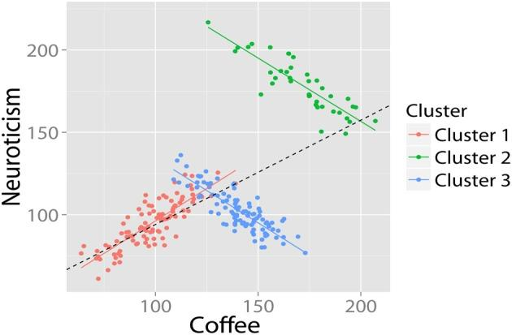

```{r setup, include=FALSE}
knitr::opts_chunk$set(echo = FALSE)
```

## Sobre mí 

- Doctor en Ingeniería Matemática 
- Especialidad en Estadística
- Investigador en el **Basque Center for Applied Mathematics** <http://www.bcamath.org>
- Area de *Data Science*
- *Group Leader* en Applied Statistics


## Paradoja

<p align="center">
  
</p>

## De qué va esta charla ...

- Ejemplo práctico de análisis de datos en los que ocurren fenómenos contradictorios.

- Basados en casos reales 

- Mostrar cómo hay que usar el sentido común y plantearnos cuestiones que análisis simples o parciales no permiten resolver

- **"Can't see the forest for the trees"**


## Discriminación en la Universidad de Berkeley

 + En 1973, la Universidad de California-Berkeley fue demandada por discriminación sexual. Las cifras parecen bastante incriminatorias: las escuelas de graduados acaban de aceptar el 44% de los candidatos hombres, pero sólo el 35% de las candidatas son mujeres. 

      Género   | Solicitudes  | % Admisión
-------------|------------- | -------------
  Hombres    |   8442       | 44%
  Mujeres    |   4321       | 35%

 + Dado que había casi 13.000 solicitantes, una diferencia del 9% en las tasas de admisión entre hombres y mujeres es demasiado grande para ser una coincidencia. 

## Discriminación en la Universidad de Berkeley

  + Datos agregados sobre los solicitantes para los **6 departamentos** más grandes clasificados por admisión/rechazo y Género (Female/Male).
 
  + **Fuente:** Bickel, P., Hammel, E., & O'Connell, J. (1975). *Sex bias in graduate admissions: data from Berkeley*. **Science**, 187(4175), 398–404. 

```{r, echo=TRUE,eval=FALSE}
 library(datasets)
 UCBAdmissions
```
 
```{r, echo=FALSE}
library(datasets)
data("UCBAdmissions")

 odds.ratio<-function(x,addtocounts=0){
  x=x+addtocounts
 (x[1,1]*x[2,2])/(x[1,2]*x[2,1])
  }
 
apply(UCBAdmissions, c(2,1), sum)
```

 + Ver visualización en <http://vudlab.com/simpsons/>


## 

 +  En %
```{r}
round(prop.table(apply(UCBAdmissions, c(2,1), sum))*100,2)
```
 

## 

 + Consideremos los 6 Departamentos más grandes (A,B,C,D,E,F)

```{r}
ftable(UCBAdmissions,row.vars="Dept",col.vars=c("Gender","Admit"))
```

 
## 

 + Consideremos los 6 Departamentos más grandes (A,B,C,D,E,F) (en %)

```{r}
ftable(round(prop.table(UCBAdmissions,c(2,3))*100,2),row.vars="Dept",col.vars=c("Gender","Admit"))
```

+ ¿Hay ahora sesgo en favor de los hombres?

## 


+  **Odds Ratio** (Condicionado al Departamento)
     - es forma de expresar la proporción de veces que un suceso ocurra frente a que no ocurra
```{r,echo=FALSE}
UCBAdmissions[,,1] 
```

`OR` del departamento A (Hombres vs Mujeres)
```{r, echo=TRUE}
(512/89)/(313/19)
```
 
  + Si `OR > 1` hay sesgo en favor de los hombres frente a las mujeres
  + Si `OR < 1` **NO hay sesgo** en favor de los hombres frente a las mujeres
    
    
##
 + **OR por departamento**


```{r}
round(apply(UCBAdmissions,3,odds.ratio),2)
```


El **OR** de aceptación de hombres es menor que el de las mujeres en los departamentos A, B, D y F.

 + Si sólo consideramos el género, ¿cuál es el odds-ratio?
 
```{r}
UCBGbyAdmission=margin.table(UCBAdmissions,c(2,1))
UCBGbyAdmission
```

El `OR` es `r odds.ratio(UCBGbyAdmission)`

##

 + La dependencia (o asociación) entre el Género y la admisión se puede comprobar estadísticamente mediante el **Test Chi-cuadrado** ($\chi^2$), en `R` con la función `chisq.test`
 
 
```{r}
chisq.test(UCBGbyAdmission,correct=FALSE)
```

`p-value` es `< 2.2e-16`, por tanto sí hay evidencia (Aquí aparece la paradoja de Simpson!)


+ Pero, ¿hay algo más?

##


 + Analicemos las solicitudes por Departamento, Género y Admisión (en %)
 
```{r}
round(prop.table(margin.table(UCBAdmissions,c(2,3)),1)*100,2)
round(prop.table(margin.table(UCBAdmissions,c(1,3)),2)*100,2)
```

 + La mayoría de los Hombres solicitan admisión en Dpto. A y B donde la aceptación tiene una tasa mayor, mientras que más Mujeres solicitan admisión a Dpto. C, D, E y F donde la aceptación tiene una tasa menor.
 

## 

+ Gráficamente

```{r, fig.align='center', fig.height=5, fig.width=9, message=FALSE, warning=FALSE}
mosaicplot(apply(UCBAdmissions, c(1, 2), sum), color=TRUE,main = "Student admissions at UC Berkeley")
```

##

```{r, fig.align='center', fig.height=6.5, fig.width=10, message=FALSE, warning=FALSE}
plot(UCBAdmissions, color=TRUE, main='Student admissions at UC Berkeley')
```

## La paradoja de Simpson (Algebraicamente)

$$
 \frac{a}{b} > \frac{c}{d} \quad \mbox{and} \quad \frac{e}{f} > \frac{g}{h} 
$$

**No implica**

$$
\frac{a+e}{b+f} > \frac{c+g}{d+h} 
$$

## La paradoja de Simpson en la empresa

 + Basado en: *Kievit, R.A., Frankenhuis, W. & Borsboom, D.*. **Simpson's Paradox in Psychological Science: A Practical Guide.** Front Psychol. 2013; 4: 513.
 
+ Supongamos una empresa de 1000 empleados. 

+ Los empleados han rellenado un test de personalidad (Big Five Personality Test)

+ Escala de 0-7 sobre el neuroticismo/inestabilidad emocional en su puesto de trabajo.

+ La escala va de 0 (nada neurótico) a 7 (muy neurótico). 

+ Estamos interesados en la medida en que este neuroticismo de los empleados se relaciona con su Rendimiento Laboral (medido de 0 a 100) y su Salario (medido en Euros por Año). 


## Gráfico Rendimiento

```{r,fig.align='center',eval=TRUE,echo=FALSE,warning=FALSE,error=FALSE,message=FALSE}
library(dplyr)
library(ggplot2)
library(scales)
alpha = 0.5

set.seed(123)
n = 1000

Neuroticism = rnorm(n)
Performance = rnorm(n) + Neuroticism * 0.1

Performance = rescale(Performance, to = c(0, 100))
# summary(Performance)
Neuroticism = rescale(Neuroticism, to = c(0, 7))
# summary(Neuroticism)

data <- data.frame(
  Performance,
  Neuroticism
)

options = c("Technical","Service")
technical = 
  (data$Performance > mean(data$Performance) & 
     data$Neuroticism > mean(data$Neuroticism)) |
  (data$Performance < mean(data$Performance) & 
     data$Neuroticism < mean(data$Neuroticism))

data$Job[technical] <- sample(options, sum(technical), T, c(0.6, 0.2))
data$Job[is.na(data$Job)] <- sample(options, sum(is.na(data$Job)), T, c(0.2, 0.8))

p <- data %>% ggplot(aes(Neuroticism, Performance)) 
p + geom_point(alpha = alpha) + geom_smooth(method = 'lm')
```

## Gráfico Salario

```{r,fig.align='center',eval=TRUE,echo=FALSE,warning=FALSE,error=FALSE,message=FALSE}
set.seed(123)
n = 1000

Neuroticism = rnorm(n)
Performance = rnorm(n) + Neuroticism * 0.1

Performance = rescale(Performance, to = c(0, 100))
# summary(Performance)
Neuroticism = rescale(Neuroticism, to = c(0, 7))
# summary(Neuroticism)

data <- data.frame(
  Performance,
  Neuroticism
)

options = c("Technical","Service")
technical = 
  (data$Performance > mean(data$Performance) & 
     data$Neuroticism > mean(data$Neuroticism)) |
  (data$Performance < mean(data$Performance) & 
     data$Neuroticism < mean(data$Neuroticism))

data$Job[technical] <- sample(options, sum(technical), T, c(0.6, 0.2))
data$Job[is.na(data$Job)] <- sample(options, sum(is.na(data$Job)), T, c(0.2, 0.8))

Education = rbinom(n, 2, 0.5)
Neuroticism = rnorm(n) + Education
Salary = Education * 2 + rnorm(n) - Neuroticism * 0.3
Neuroticism = rescale(Neuroticism, to = c(0, 7))
data <- data.frame(
  Performance,
  Neuroticism, Salary
)

options = c("Technical","Service")
technical = 
  (data$Performance > mean(data$Performance) & 
     data$Neuroticism > mean(data$Neuroticism)) |
  (data$Performance < mean(data$Performance) & 
     data$Neuroticism < mean(data$Neuroticism))

data$Job[technical] <- sample(options, sum(technical), T, c(0.6, 0.2))
data$Job[is.na(data$Job)] <- sample(options, sum(is.na(data$Job)), T, c(0.2, 0.8))

p <- data %>% ggplot(aes(Neuroticism, Salary)) 
p + geom_point(alpha = alpha) + geom_smooth(method = 'lm')
```

## Neuroticismo VS Salario/Rendimiento 

+ A partir de estas visualizaciones parecería que el neuroticismo se relaciona de manera significativa y positiva tanto con el rendimiento de los empleados como con su salario anual. 


+ ¿Debería seleccionar más personas neuróticas para mejorar el rendimiento general de su empresa? 

+ ¿O está discriminando emocionalmente a los empleados estables (no neuróticos) cuando se trata del salario?


## Gráfico por tipo de trabajo

```{r,fig.align='center',eval=TRUE,echo=FALSE,warning=FALSE,error=FALSE,message=FALSE}
library(ggplot2)
library(scales)
alpha = 0.5

set.seed(123)
n = 1000

Neuroticism = rnorm(n)
Performance = rnorm(n) + Neuroticism * 0.1

Performance = rescale(Performance, to = c(0, 100))
# summary(Performance)
Neuroticism = rescale(Neuroticism, to = c(0, 7))
# summary(Neuroticism)

data <- data.frame(
  Performance,
  Neuroticism
)

options = c("Technical","Service")
technical = 
  (data$Performance > mean(data$Performance) & 
     data$Neuroticism > mean(data$Neuroticism)) |
  (data$Performance < mean(data$Performance) & 
     data$Neuroticism < mean(data$Neuroticism))

data$Job[technical] <- sample(options, sum(technical), T, c(0.6, 0.2))
data$Job[is.na(data$Job)] <- sample(options, sum(is.na(data$Job)), T, c(0.2, 0.8))

p <- data %>% ggplot(aes(Neuroticism, Performance)) 

p +
  geom_point(aes(col = Job), alpha = alpha) + 
  geom_smooth(aes(col = Job), method = 'lm') +
  theme(legend.background = element_rect(fill = "transparent"),
        legend.justification = c(0, 1),
        legend.position = c(0, 1))
```
 
## 

+ Mirando más de cerca los subgrupos en sus datos, sin embargo, podría encontrar relaciones muy diferentes. 

+ Por ejemplo, la relación positiva entre el neuroticismo y el rendimiento sólo se puede aplicar a los puestos técnicos, pero no a aquellos empleados en empleos orientados al servicio.

+ Del mismo modo, al dividir a los empleados por nivel de formación, queda claro que existe una relación entre el neuroticismo y el nivel educativo que puede explicar la asociación anterior con el salario.

+ Los empleados con mayor nivel educativo reciben salarios más altos y dentro de estos grupos, el neuroticismo está relacionado con menores ingresos anuales.


## Gráfico por Nivel Educativo

```{r,fig.align='center',eval=TRUE,echo=FALSE,warning=FALSE,error=FALSE,message=FALSE}
set.seed(123)
n = 1000

Education = rbinom(n, 2, 0.5)
Neuroticism = rnorm(n) + Education
Salary = Education * 2 + rnorm(n) - Neuroticism * 0.3

Salary = sample(10000:11000,1) + rescale(Salary, to = c(0, 100000))
# summary(Salary)
Neuroticism = rescale(Neuroticism, to = c(0, 7))
# summary(Neuroticism)
Education = factor(Education, labels = c("Low", "Medium", "High"))

data <- data.frame(
  Salary,
  Neuroticism,
  Education
)

p <- data %>% ggplot(aes(Neuroticism, Salary)) 
#p + geom_point(alpha = alpha) + geom_smooth(method = 'lm')

p + 
  geom_point(aes(col = Education), alpha = alpha) + 
  geom_smooth(aes(col = Education), method = 'lm') +
  theme(legend.background = element_rect(fill = "transparent"),
        legend.justification = c(0, 1),
        legend.position = c(0, 1))
```

## Algunas conclusiones

 + La paradoja de Simpson puede ocurrir en una amplia variedad de diseños, métodos y preguntas de investigación, particularmente dentro de las ciencias sociales y médicas. 
 
 + Existen varias maneras para "controlar" o minimizar el riesgo de que ocurra. 
 
 + La paradoja puede prevenirse mediante un diseño de investigación más riguroso: mecanismos de prueba en estudios longitudinales o de intervención. 
 
 + Sin embargo, esto no siempre es factible. 
 
 + Alternativamente, la visualización de datos puede ayudar a reconocer los patrones y subgrupos y por lo tanto diagnosticar las paradojas. 


## En `R`

+ `library(Simpsons)` 

      - **Simpsons: Detecting Simpson's Paradox**

*This package detects instances of Simpson's Paradox in datasets. It examines subpopulations in the data, either user-defined or by means of cluster analysis, to test whether a regression at the level of the group is in the opposite direction at the level of subpopulations.*


## Métodos de Clustering


 
 + En el trabajo de Las técnicas de clustering puede ayudar a detectar la paradoja de Simpson cuando no es directamente observable en los datos.
 
 + Se encontraron patrones relacionados con el consumo de café.

<p align="center">
  
</p>

